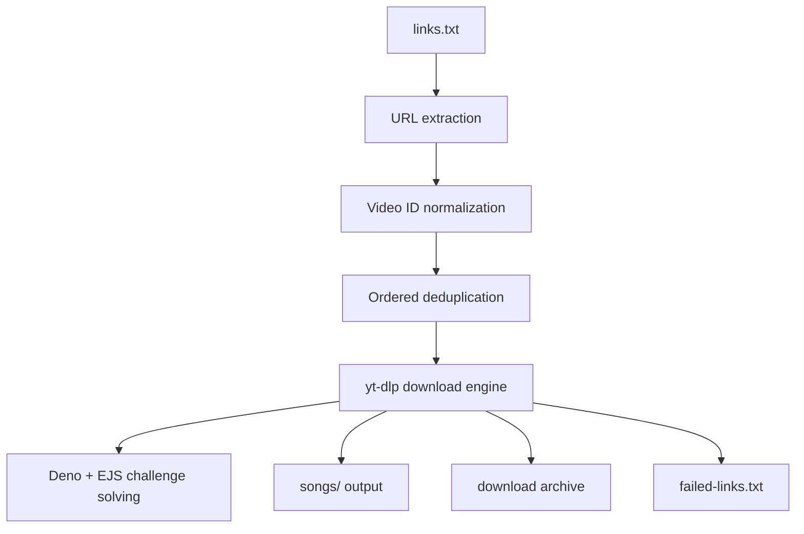

# **🎵 Python Batch Audio Downloader**

A Python CLI tool for extracting YouTube links and downloading audio files in batch.

The application can process multiple YouTube URLs, remove duplicate links, use browser cookies for authenticated access, and 

download the best available audio format automatically.


## **✨ Features**
- 🔗 Extracts YouTube URLs from text
- 📦 Batch downloads multiple audio files
- 🧹 Automatically removes duplicate URLs
- 🎧 Downloads the best available audio quality
- 🍪 Supports browser cookies through Brave
- 🔁 Includes retry handling for failed downloads
- ⏱️ Adds configurable delays between requests
- 📁 Automatically organizes downloaded files
- 🐍 Simple Python CLI workflow


## Why This Project?

Downloading a few audio files manually is simple.

Downloading dozens of them introduces repetitive work:

Open URL

   ↓

Start download

   ↓

Choose format

   ↓

Wait

   ↓

Repeat for every URL

   ↓

Remember what was already downloaded

   ↓

Retry failed downloads


This project automates that workflow.

The user provides a text file containing YouTube links and the application handles the rest:
```
links.txt
    │
    ▼
Extract URLs
    │
    ▼
Validate & Normalize
    │
    ▼
Deduplicate by Video ID
    │
    ▼
Configure Download
    │
    ▼
Batch Processing
    │
    ├──► Download Archive
    ├──► Failed Link Tracking
    └──► Audio Output
```
The goal is not simply to download audio, but to make repeated batch downloads automated, reproducible, and recoverable.

## Features
**Batch Automation**

- Reads YouTube URLs directly from a text file

- Processes multiple videos in one execution

- Extracts URLs automatically from surrounding text

- Normalizes supported YouTube URL formats

- Deduplicates videos using their video IDs

- Processes downloads sequentially without manual intervention

**Interactive CLI**

Running the application without arguments launches an interactive configuration wizard.

The wizard allows the user to configure:

- input file
- output directory
- authentication method
- browser profile
- audio format
- conversion quality
- request delays
- dry-run mode

The selected configuration is displayed before execution for confirmation.

**Authentication**

Optional authentication can be provided through:

- Brave
- Chrome
- Edge
- Firefox
- Netscape-format cookies.txt

Guest downloads are also supported.

**Audio Processing**

The downloader retrieves the best available source audio by default.

Optional conversion is available for:

- MP3
- M4A

Audio conversion requires FFmpeg.

**Reliability**

The workflow includes:

- download retries
- fragment retries
- configurable request delays
- randomized sleep intervals
- persistent download archive
- failed-download tracking
- graceful interruption handling

Previously downloaded videos can therefore be tracked across executions instead of managing the batch manually.



**Processing Pipeline**

**1. Input**

The application reads URLs from a text file.

Default:

links.txt

The file does not need to contain only URLs. YouTube links can be extracted from surrounding text.

**2. URL Extraction**

A regular expression identifies supported YouTube URLs.

Supported URL structures include common forms such as:

- youtube.com/watch?v=...
- youtu.be/...
- youtube.com/shorts/...
- youtube.com/embed/...
- youtube.com/live/...

**3. Normalization**

URLs are converted into a consistent format:

```https://www.youtube.com/watch?v=VIDEO_ID```

**4. Deduplication**

Duplicates are identified using the YouTube video ID rather than only comparing raw URL strings.

Therefore, different URLs pointing to the same video are processed only once.

**5. Configuration**

Download behavior is generated from CLI arguments or the interactive setup wizard.

**6. Batch Execution**

yt-dlp processes each normalized URL sequentially.

**7. Recovery State**

The application maintains:

download-archive.txt

to track processed downloads.

Failed downloads are written to:

failed-links.txt

so unsuccessful items can be inspected or retried separately.

## Project Structure
```Python-Batch-Audio-Downloader/
│
├── downloader.py
├── main.py
├── requirements.txt
├── .gitignore
└── README.md
downloader.py
```

**Main CLI implementation containing:**

```argument parsing
interactive wizard
URL extraction
URL normalization
validation
deduplication
yt-dlp configuration
batch execution
error handling
download state management
```

```main.py```


Initial/minimal implementation of the batch downloader.

```requirements.txt```

Python dependencies required by the project.


## Design Decisions

### Deduplicate by video ID

Comparing raw URLs is insufficient because multiple YouTube URL formats can reference the same video.

The application extracts the video ID first and uses it as the deduplication key.

### **Separate input from execution**

URLs are stored in a text file rather than hardcoded into the application.

This makes batches easy to replace and keeps application logic independent from user data.

### **Persistent download archive**

Batch automation becomes more useful when execution can be resumed.

A persistent archive allows the downloader to maintain state across runs and avoid treating every execution as a completely new batch.

### **Failure isolation**

One failed download should not invalidate an entire batch.

Failures are collected separately so the remaining jobs can continue processing.


## **Author**

**Aysel Musayeva**

Python automation project focused on CLI engineering, batch processing, resilient workflows, and reducing repetitive manual operations.
